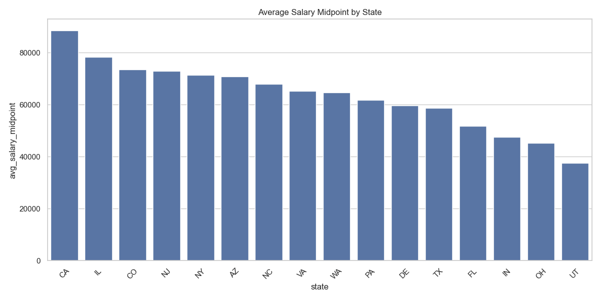
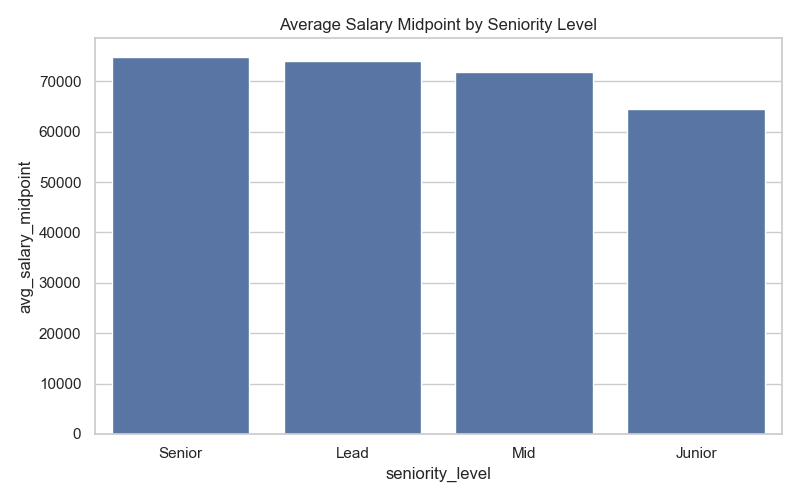
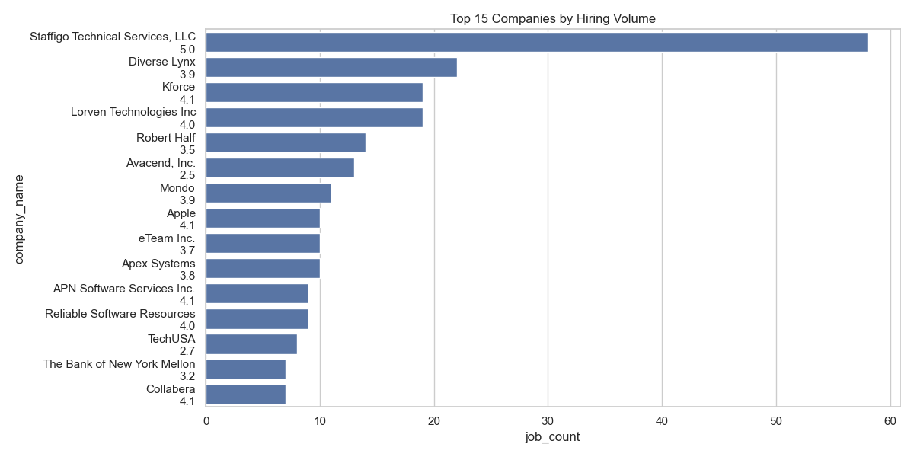
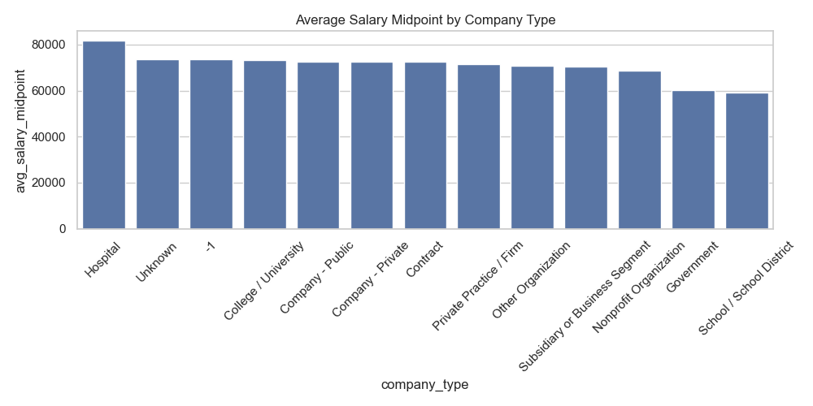
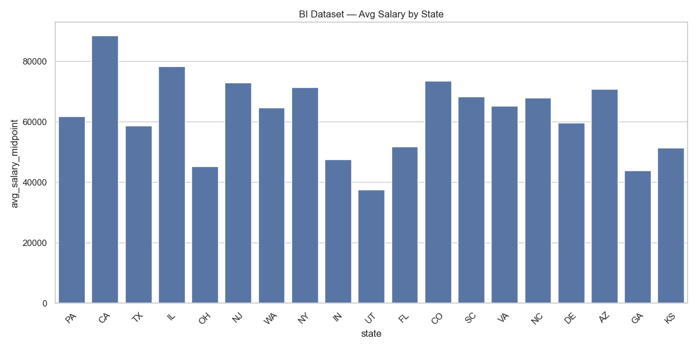

# 💼 **Analyzing the Data Analyst Job Market with SQL**
<br>

**Tool** : PostgreSQL  
**Visualization** : Python (pandas, matplotlib, seaborn)  
**Dataset** : Kaggle – Data Analyst Job Listings (Glassdoor)  

## 🔹 Project Highlights

- Membangun model data dimensional (fact & dimension tables) di PostgreSQL untuk analisis analitik.
- Menganalisis 2.253 lowongan untuk mengidentifikasi pola gaji berdasarkan lokasi, senioritas, dan tipe perusahaan.
- Menghasilkan dataset agregat siap BI untuk dashboard dan pelaporan lanjutan.

<br>
<br>

**Table of Contents**
- [STAGE 0: Problem Statement](#-stage-0-problem-statement)
	- [Background Story](#background-story)
	- [Objective](#objective)
- [STAGE 1: Data Preparation](#-stage-1-data-preparation)
	- [Create Database and ERD](#create-database-and-erd)
- [STAGE 2: Data Analysis](#-stage-2-data-analysis)
	- [Salary Trends by State](#1-salary-trends-by-state)
	- [Salary Trends by Seniority Level](#2-salary-trends-by-seniority-level)
	- [Top Companies by Hiring Volume](#3-top-companies-by-hiring-volume)
	- [Salary by Company Type](#4-salary-by-company-type)
	- [Easy Apply vs Salary](#5-easy-apply-vs-salary)
	- [BI-Ready Aggregate Dataset](#6-bi-ready-aggregate-dataset)
- [STAGE 3: Summary](#-stage-3-summary)
<br>
<br>

---

## 📂 **STAGE 0: Problem Statement**

### **Background Story**
Pasar kerja untuk Data Analyst berkembang pesat, namun pencari kerja sering tidak memiliki gambaran yang jelas mengenai variasi gaji berdasarkan lokasi, senioritas, dan karakteristik perusahaan.  
Informasi yang terfragmentasi membuat proses negosiasi gaji dan perencanaan karier menjadi kurang optimal.

Dalam proyek ini dilakukan analisis terhadap data lowongan pekerjaan Data Analyst untuk memahami pola kompensasi dan struktur pasar kerja secara kuantitatif menggunakan SQL dan visualisasi Python.

---

### **Objective**
Mengumpulkan insight dari analisis data lowongan kerja Data Analyst untuk:
1. Mengidentifikasi negara bagian dengan gaji tertinggi  
2. Menganalisis perbedaan gaji berdasarkan level senioritas  
3. Menentukan perusahaan dengan volume hiring tertinggi  
4. Menganalisis variasi gaji berdasarkan tipe perusahaan  
5. Menguji hubungan antara fitur *Easy Apply* dan tingkat gaji  
6. Menyediakan lapisan data agregat siap BI untuk visualisasi lanjutan  

<br>
<br>

---

## 📂 **STAGE 1: Data Preparation**

Dataset yang digunakan berasal dari Kaggle (Glassdoor Data Analyst Jobs) dengan total **2,253 baris data**.  
Dataset mencakup informasi lowongan kerja seperti:
- Job title  
- Company name  
- Salary range  
- Location (city, state, country)  
- Seniority level  
- Industry, sector  
- Rating perusahaan  
- Fitur Easy Apply  

Data dibersihkan menggunakan Python sebelum dimuat ke PostgreSQL, termasuk:
- Parsing salary range menjadi `salary_min` dan `salary_max`  
- Normalisasi job title ke dalam `title_clean`  
- Klasifikasi seniority level (Junior, Mid, Senior, Lead)  
- Pemisahan lokasi menjadi `city`, `state`, `country`  

---

### **Create Database and ERD**
**Langkah-langkah yang dilakukan meliputi:**
1. Membuat database PostgreSQL bernama `job_market_intelligence`  
2. Mengimpor data CSV ke tabel staging (`staging_jobs`)  
3. Membuat skema dimensional (`dim_company`, `dim_location`, `dim_job_title`, `dim_seniority`)  
4. Membuat tabel fakta (`fact_job_postings`)  
5. Menentukan Primary Key dan Foreign Key  
6. Memastikan integritas relasi dan jumlah baris konsisten  

<details>
<summary>Click untuk melihat Queries</summary>

```sql
CREATE TABLE staging_jobs (
  job_title_raw TEXT,
  title_clean TEXT,
  seniority_level TEXT,
  salary_min INT,
  salary_max INT,
  company_name TEXT,
  industry TEXT,
  sector TEXT,
  company_type TEXT,
  founded_year INT,
  size TEXT,
  revenue TEXT,
  rating NUMERIC,
  location TEXT,
  city TEXT,
  state TEXT,
  country TEXT,
  easy_apply BOOLEAN
);

CREATE TABLE dim_company (
  company_id SERIAL PRIMARY KEY,
  company_name TEXT UNIQUE,
  industry TEXT,
  sector TEXT,
  company_type TEXT,
  founded_year INT,
  size TEXT,
  revenue TEXT,
  headquarters TEXT,
  rating NUMERIC
);

CREATE TABLE dim_location (
  location_id SERIAL PRIMARY KEY,
  city TEXT,
  state TEXT,
  country TEXT
);

CREATE TABLE dim_job_title (
  job_title_id SERIAL PRIMARY KEY,
  job_title_raw TEXT UNIQUE,
  title_clean TEXT
);

CREATE TABLE dim_seniority (
  seniority_id SERIAL PRIMARY KEY,
  seniority_level TEXT UNIQUE
);

CREATE TABLE fact_job_postings (
  company_id INT REFERENCES dim_company(company_id),
  location_id INT REFERENCES dim_location(location_id),
  job_title_id INT REFERENCES dim_job_title(job_title_id),
  seniority_id INT REFERENCES dim_seniority(seniority_id),
  salary_min INT,
  salary_max INT,
  easy_apply BOOLEAN
);
```

</details>

<br>
<br>

---

## 📂 **STAGE 2: Data Analysis**

### **1. Salary Trends by State**

```sql
SELECT
    l.state,
    COUNT(*) AS job_count,
    ROUND(AVG(f.salary_min), 0) AS avg_salary_min,
    ROUND(AVG(f.salary_max), 0) AS avg_salary_max,
    ROUND(AVG((f.salary_min + f.salary_max) / 2), 0) AS avg_salary_midpoint,
    MIN(f.salary_min) AS lowest_salary_min,
    MAX(f.salary_max) AS highest_salary_max
FROM fact_job_postings f
JOIN dim_location l ON f.location_id = l.location_id
WHERE f.salary_min IS NOT NULL
  AND f.salary_max IS NOT NULL
GROUP BY l.state
HAVING COUNT(*) >= 5
ORDER BY avg_salary_midpoint DESC;
```
**Visualization: Average Salary by State**



Insight:
- California memiliki rata-rata gaji tertinggi (≈ 88 ribu) sekaligus volume lowongan terbesar, menunjukkan konsentrasi pasar kerja yang sangat kuat.
- Terdapat kesenjangan gaji yang besar antar negara bagian, dari sekitar 37 ribu hingga 88 ribu.
- Negara bagian dengan jumlah lowongan kecil cenderung memiliki rata-rata gaji yang kurang stabil.

---

### **2. Salary Trends by Seniority Level**

```sql
SELECT
    s.seniority_level,
    COUNT(*) AS job_count,
    ROUND(AVG(f.salary_min), 0) AS avg_salary_min,
    ROUND(AVG(f.salary_max), 0) AS avg_salary_max,
    ROUND(AVG((f.salary_min + f.salary_max) / 2), 0) AS avg_salary_midpoint,
    MIN(f.salary_min) AS lowest_salary_min,
    MAX(f.salary_max) AS highest_salary_max
FROM fact_job_postings f
JOIN dim_seniority s ON f.seniority_id = s.seniority_id
WHERE f.salary_min IS NOT NULL
  AND f.salary_max IS NOT NULL
GROUP BY s.seniority_level
ORDER BY avg_salary_midpoint DESC;
```
**Visualization: Salary Distribution by Seniority Level**



Insight:
- Level Senior memiliki midpoint gaji tertinggi, sedikit lebih tinggi dibandingkan Lead.
- Perbedaan gaji antara Mid dan Senior relatif kecil, menunjukkan kenaikan gaji melambat pada level menengah ke atas.
- Terdapat selisih sekitar 10 ribu antara Junior dan Senior, menunjukkan dampak signifikan dari pengalaman kerja terhadap kompensasi.

---

### **3. Top Companies by Hiring Volume**

```sql
SELECT
    c.company_name,
    COUNT(*) AS job_count,
    ROUND(AVG((f.salary_min + f.salary_max) / 2), 0) AS avg_salary_midpoint
FROM fact_job_postings f
JOIN dim_company c ON f.company_id = c.company_id
WHERE f.salary_min IS NOT NULL
  AND f.salary_max IS NOT NULL
GROUP BY c.company_name
HAVING COUNT(*) >= 5
ORDER BY job_count DESC
LIMIT 15;
```

**Visualization: Top Hiring Companies**



Insight:
- Volume hiring sangat terkonsentrasi pada satu perusahaan, dengan Staffigo mendominasi jumlah lowongan secara signifikan.
- Sebagian besar perusahaan dengan hiring tertinggi merupakan perusahaan staffing dan consulting.
- Perusahaan dengan volume hiring tinggi tidak selalu menawarkan gaji tertinggi, terlihat dari perusahaan seperti Apple yang memiliki gaji tinggi namun volume rendah.

---

### **4. Salary by Company Type**

```sql
SELECT
    c.company_type,
    COUNT(*) AS job_count,
    ROUND(AVG(f.salary_min), 0) AS avg_salary_min,
    ROUND(AVG(f.salary_max), 0) AS avg_salary_max,
    ROUND(AVG((f.salary_min + f.salary_max) / 2), 0) AS avg_salary_midpoint
FROM fact_job_postings f
JOIN dim_company c ON f.company_id = c.company_id
WHERE f.salary_min IS NOT NULL
  AND f.salary_max IS NOT NULL
  AND c.company_type IS NOT NULL
GROUP BY c.company_type
HAVING COUNT(*) >= 5
ORDER BY avg_salary_midpoint DESC;
```

**Visualization: Salary by Company Type**



Insight:
- Organisasi bertipe Hospital menawarkan rata-rata gaji tertinggi di antara seluruh tipe perusahaan.
- Government dan School / School District memiliki gaji terendah, sekitar 59–60 ribu.
- Sebagian besar tipe perusahaan berada pada rentang midpoint yang sempit (sekitar 70–73 ribu), menunjukkan diferensiasi gaji berdasarkan tipe organisasi relatif terbatas.

---

### **5. Easy Apply vs Salary**

```sql
SELECT
    f.easy_apply,
    COUNT(*) AS job_count,
    ROUND(AVG((f.salary_min + f.salary_max) / 2), 0) AS avg_salary_midpoint,
    MIN(f.salary_min) AS lowest_salary_min,
    MAX(f.salary_max) AS highest_salary_max
FROM fact_job_postings f
WHERE f.salary_min IS NOT NULL
  AND f.salary_max IS NOT NULL
GROUP BY f.easy_apply
ORDER BY f.easy_apply;
```

**Visualization: Easy Apply vs Salary**


Insight:
- Lowongan dengan fitur Easy Apply memiliki rata-rata gaji lebih tinggi (≈ 77 ribu) dibandingkan non–Easy Apply (≈ 72 ribu).
- Namun, jumlah lowongan Easy Apply sangat kecil (80 vs 2.171), sehingga hasil ini berpotensi bias sampel.
- Temuan ini perlu diinterpretasikan dengan hati-hati karena ketidakseimbangan jumlah data.

---

### **6. BI-Ready Aggregate Dataset**

```sql
SELECT
    l.state,
    COUNT(*) AS job_count,
    ROUND(AVG(f.salary_min), 0) AS avg_salary_min,
    ROUND(AVG(f.salary_max), 0) AS avg_salary_max,
    ROUND(AVG((f.salary_min + f.salary_max) / 2), 0) AS avg_salary_midpoint
FROM fact_job_postings f
JOIN dim_location l ON f.location_id = l.location_id
WHERE f.salary_min IS NOT NULL
  AND f.salary_max IS NOT NULL
GROUP BY l.state;
```

**Visualization: BI-Ready Salary Dataset**



Insight:
- Dataset agregat ini mempertahankan pola gaji utama berdasarkan negara bagian dengan jumlah baris yang jauh lebih ringkas.
- Tabel ini siap digunakan sebagai lapisan fakta untuk dashboard BI dan analisis lanjutan.
- Struktur agregasi memudahkan pembuatan benchmark gaji antar wilayah secara cepat.

---

## 📂 **STAGE 3: Summary**

Berdasarkan analisis terhadap 2.253 lowongan pekerjaan Data Analyst, diperoleh beberapa temuan utama sebagai berikut:

- **California** merupakan negara bagian dengan rata-rata gaji tertinggi (≈ 88 ribu) sekaligus volume lowongan terbesar, menunjukkan konsentrasi pasar kerja data yang sangat kuat di wilayah tersebut.

- Terdapat kesenjangan gaji geografis yang besar, dengan rentang midpoint gaji antar negara bagian berkisar dari sekitar **37 ribu hingga 88 ribu**.

- Berdasarkan seniority level, **Senior** memiliki midpoint gaji tertinggi, sedikit di atas **Lead**, sementara **Junior** berada sekitar **10 ribu lebih rendah** dibandingkan Senior, menunjukkan dampak signifikan pengalaman kerja terhadap kompensasi.

- Volume hiring sangat terkonsentrasi pada segelintir perusahaan, terutama perusahaan **staffing dan consulting**, sementara perusahaan dengan gaji tertinggi tidak selalu memiliki volume lowongan terbesar.

- Berdasarkan tipe perusahaan, **Hospital** menawarkan gaji tertinggi, sedangkan **Government** dan **School District** berada pada kelompok dengan gaji terendah.

- Lowongan dengan fitur **Easy Apply** menunjukkan rata-rata gaji lebih tinggi, namun jumlah datanya sangat kecil dibandingkan non–Easy Apply, sehingga hasil ini perlu diinterpretasikan dengan hati-hati.

Secara keseluruhan, analisis ini menunjukkan bahwa **lokasi geografis, level senioritas, dan karakteristik perusahaan** merupakan faktor utama dalam menentukan tingkat kompensasi Data Analyst.  
Dataset agregat akhir disiapkan sebagai **lapisan siap BI** untuk mendukung dashboard dan pelaporan lanjutan.
